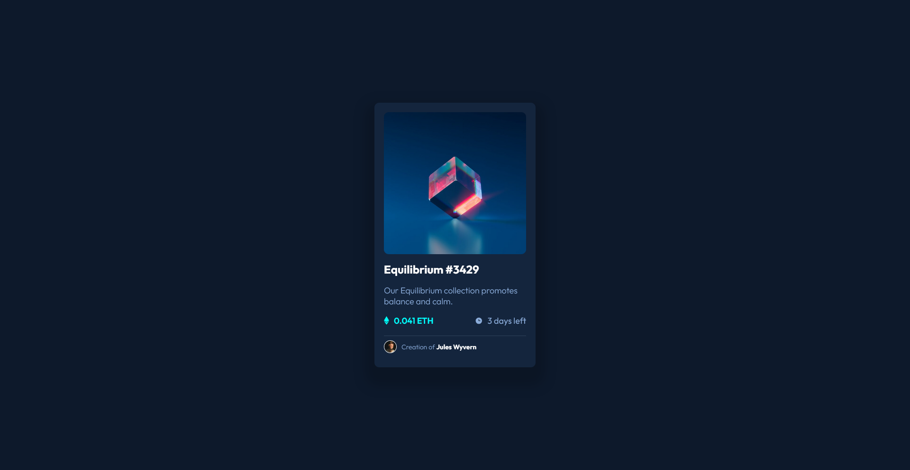

# Frontend Mentor - NFT preview card component solution

This is a solution to the [NFT preview card component challenge on Frontend Mentor](https://www.frontendmentor.io/challenges/nft-preview-card-component-SbdUL_w0U). Frontend Mentor challenges help you improve your coding skills by building realistic projects.

## Table of contents

- [Overview](#overview)
  - [The challenge](#the-challenge)
  - [Screenshot](#screenshot)
  - [Links](#links)
- [My process](#my-process)
  - [Built with](#built-with)
  - [What I learned](#what-i-learned)
  - [Continued development](#continued-development)
- [Author](#author)

**Note: Delete this note and update the table of contents based on what sections you keep.**

## Overview

### The challenge

Users should be able to:

- View the optimal layout depending on their device's screen size
- See hover states for interactive elements

### Screenshot



### Links

- Solution URL: [Solution URL here](https://github.com/imandreans/nft-preview-card-component-main)
- Live Site URL: [Live Site URL here](https://imandreans.github.io/nft-preview-card-component-main/)

## My process

### Built with

- Semantic HTML5 markup
- CSS custom properties
- Flexbox

### What I learned

I learn how to utilize CSS to make Icon View appears when we hover the image. Below is the code to make it happens.

```
#view-nft {
    border-radius: 10px;
    width: 100%;
    height: 100%;
    top: 0;
    left: 0;
    position: absolute;
    display: flex;
    justify-content: center;
    align-items: center;
    flex-direction: column;
    opacity: 0;
    background: rgba(0, 255, 247, 0.6);
    transition: 0.6s;
    background-image: url("images/icon-view.svg");
    background-repeat: no-repeat;
    background-position: center;
  }
  #view-nft:hover {
    opacity: 1;
  }
```

### Continued development

I want to improve the design more by testing and debugging it. But, I still need to learn more about how to use Percy.

## Author

- Website - [Andrean](https://portfolio-gamma-three-44.vercel.app/)
- Frontend Mentor - [@imandreans](https://www.frontendmentor.io/profile/imandreans)
- Twitter - [@imandreans](https://www.twitter.com/imandreans)
